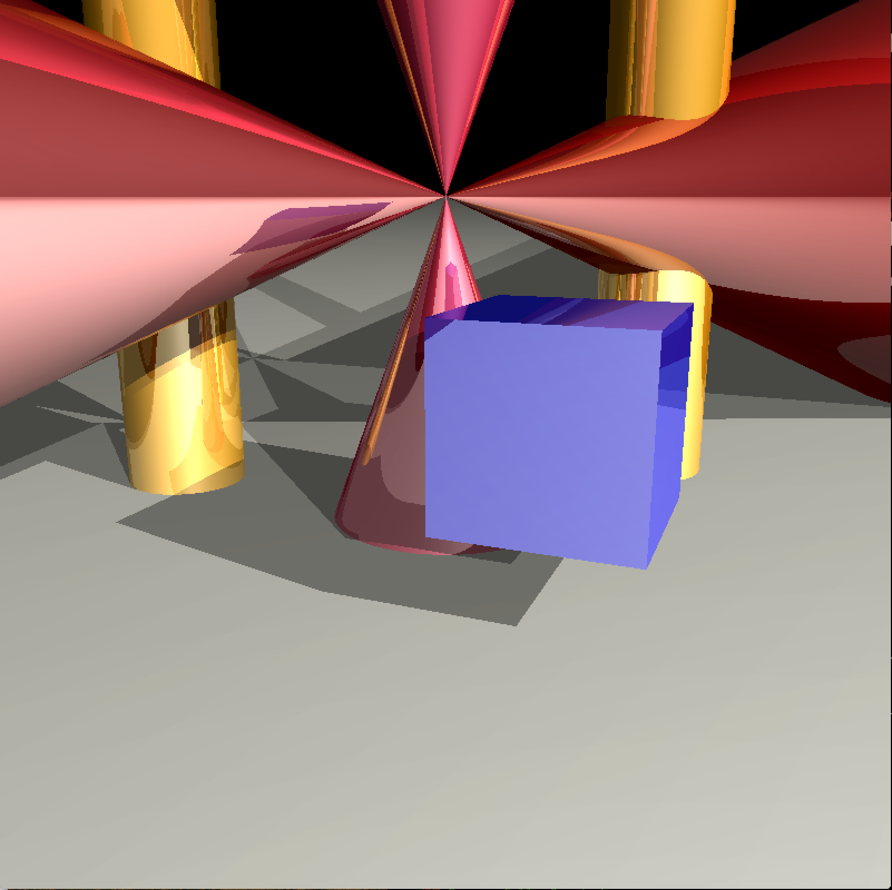
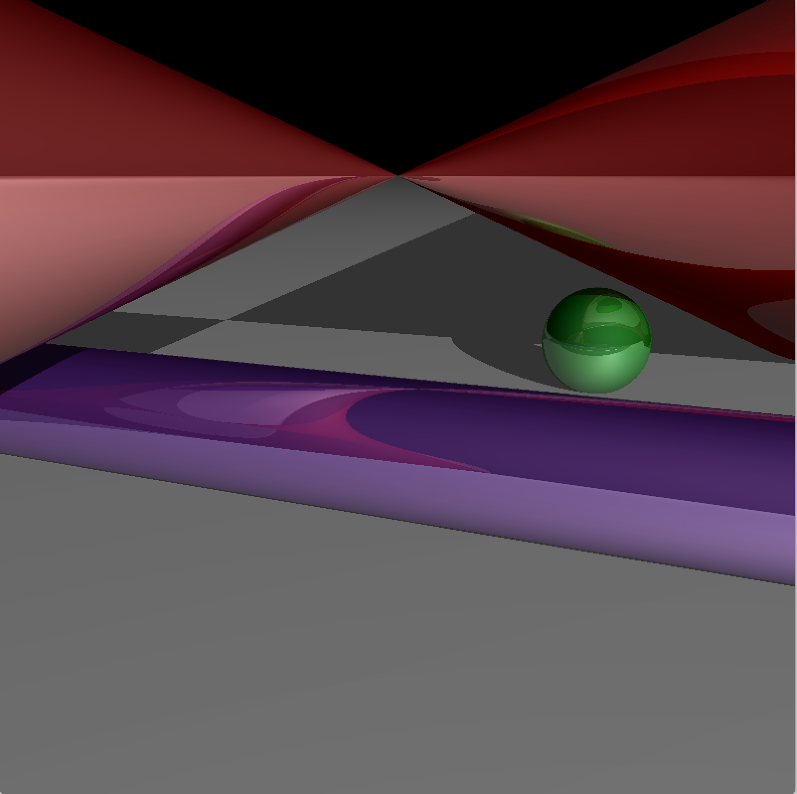
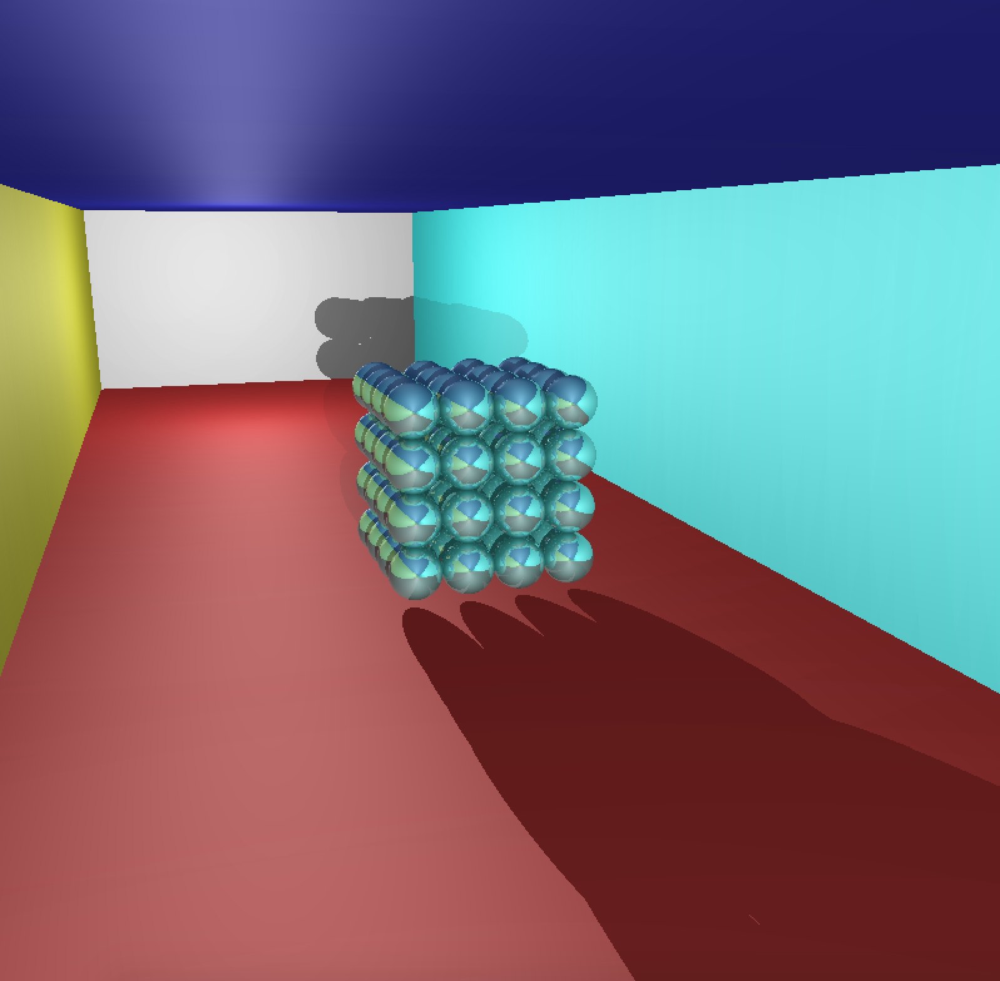
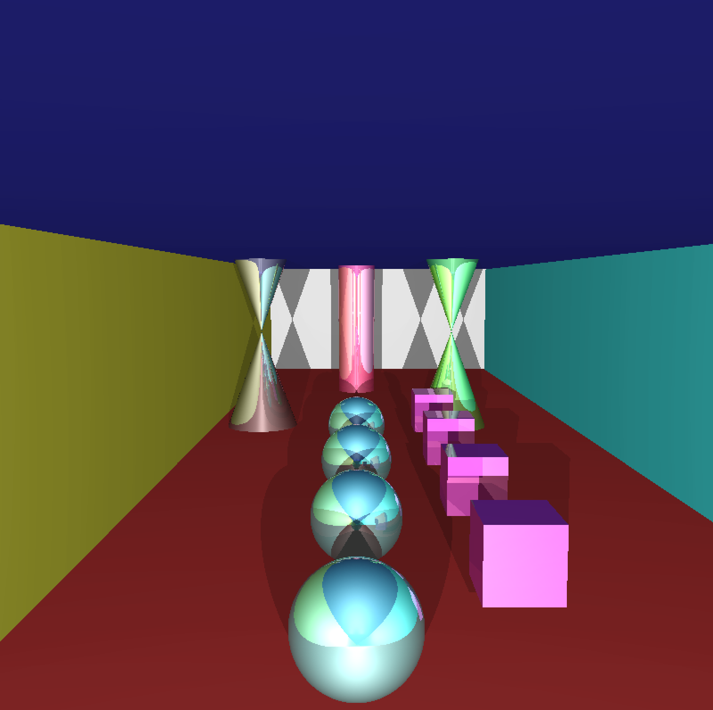
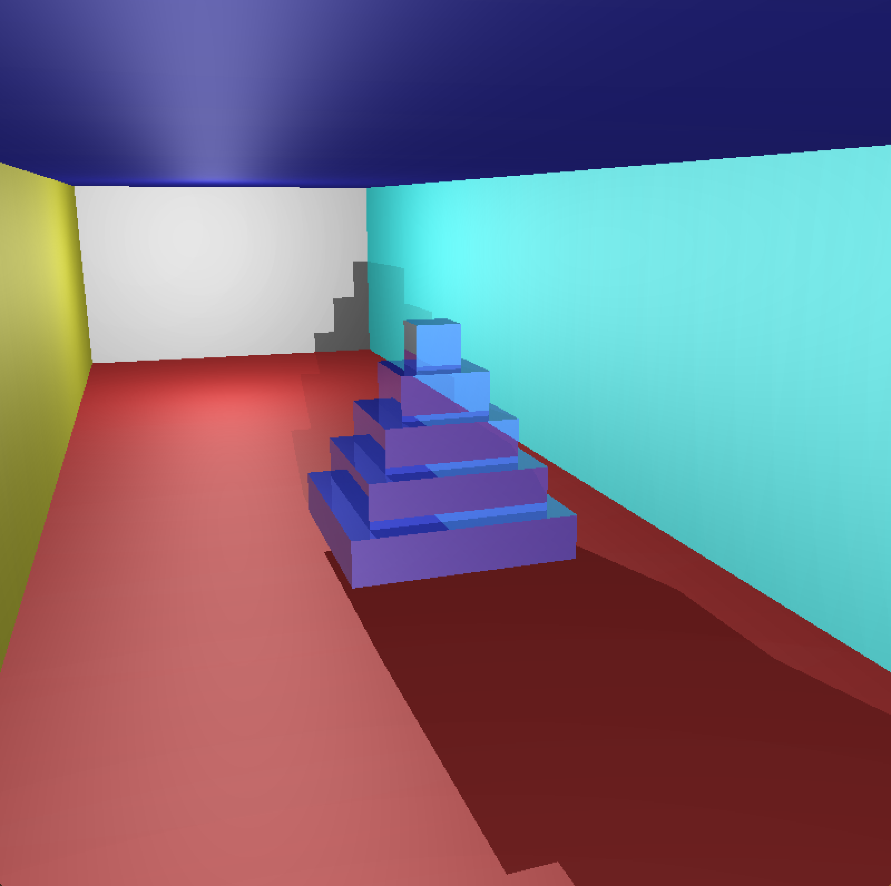
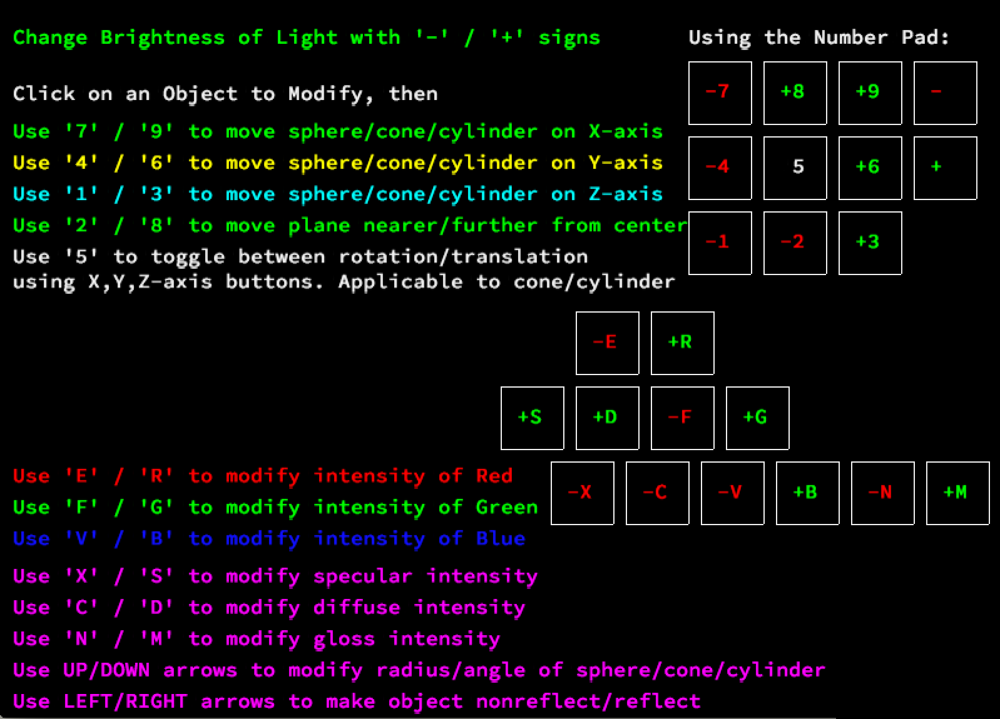

<h1 align="center">Raytracer Project for RT @42</h1>
<h4 align="center">Authors <a href="https://github.com/elopez17" target="blank">Eric Lopez</a> & <a href="https://github.com/obsaa" target="blank">Obsaa Abdalhalim</a></h4>

<p align="center">
  
  
  
  
  
  
  
  
</p>

## What is is Raytracing
This is rendering technique used to generate a image by by tracing the path of light in an image plane and simulating the  effects of it encounters with virtual objects. This raytracing project uses <a href="https://github.com/elopez17/RT/blob/master/info/backward_ray_tracing.gif">backward raytracing</a> algorithms as a means of lowering the computational cost normally related <a href="https://github.com/elopez17/RT/blob/master/info/backward_ray_tracing.gif">forward raytracing</a>, which is looking at everything a light ray touches in every direction from the light source. Backward raytracing instead shoots rays from the camera view onto the object(s) and measure the distance to the light source rather than calculating the rays that would never reach the pixels that will never reach the camera view.


## Make and Features
#### Build Info
There definitely languages better than C to run a raytracer algorithm eficiently but part of the assignment is using C and C libraries [most notably C++]. In the confines of our school standards which require we have no function longer than 25 lines [which is the most imminent of the many requirements of the standard we call norm], our major library functions such as printf [inside of the src/libft/ folder]. This raytracer is multithreaded but the benefits of multithreading was not seismic due to using mutexes to let the image render properly when objects are reflective. The benefits of multithreading can be seen with raytracers that don't require reflection since algorithms are run once without worrying about how pockets of pixels change due recursive calls made on each thread. Assignment Requirements [<a href="https://cdn.intra.42.fr/pdf/pdf/964/rt.en.pdf" target="blank">Link</a>]


#### Program Requirements && Running Executable
To be able to build and run this program you'll need a macbook, because we didn't make it portable for other systems. As for software Requirements, you'll need in order to compile:

* No specific versions. [Unless you are using a version llvm that shows error using -Werror at compile time, take off or add those flags out of the makefile as needed.]
* GNU make
* GCC / CLANG
* Built using the minilibx library instead of OpenGL graphics library.

1. Clone the repo.
2. Access the main folder with makefile with  `cd RT`.
3. Run  `make`.
4. Run  `./RT scenes/scene`[*number*]`.rt`


#### File Tree
```
RT/[GIT REPO]
├── sources/
│   ├── includes/
│   │   ├── ft_printf.h
│   │   ├── get_next_line.h
│   │   ├── libft.h
│   │   └── rt.h
│   ├── minilibx/
│   ├── libft/
│   └── src/
│       ├── add_obj.c
│       ├── colors.c
│       ├── controls.c
│       ├── draw.c
│       ├─- error.c
│       ├── events.c
│       ├── filters.c
│       ├── intersect.c
│       ├── intersect2.c
│       ├── light.c
│       ├── main.c
│       ├── mod.c
│       ├── mod2.c
│       ├── normals.c
│       ├── parse.c
│       ├── parse2.c
│       ├── parse3.c
│       ├── putpixel.c
│       ├── scene.c
│       ├── threads.c
│       ├── vect.c
│       └── vect2.h
├── scenes/
│   ├── scene1.rt
│   ├── scene2.rt
│   ├── scene3.rt
│   ├── scene4.rt
│   ├── scene5.rt
│   ├── scene6.rt
│   ├── scene7.rt
│   ├── scene8.rt
│   ├── scene9.rt
│   ├── scene10.rt
│   ├── scene11.rt
│   ├── scene12.rt
│   └── scene13.rt
├── info/
│   ├── backward_ray_tracing.gif
│   ├── forward_ray_tracing.gif
│   ├── box.ps
│   └── rt.en.pdf
└── Makefile

```


#### Features Outlined
Feautres are outlined in the first window upon execution of the any of the valid scenes. These features let you control the following (to modify object first click on it):
* Translation/Rotation (Moving sphere, cone, cylinder on the x, y, z plane)
	* (7/9[X-Axis] || 4/6[Y-Axis] || 1/3[Z-Axis] || 5[Toggle Trans/Rot])
* Moving plane to center [8 (INCREASE) || 2 (DECREASE)]
* NonReflection / Reflective / Refraction Property of each object [Left (OFF) || Right (ON)]
* Size of Objects [Up Key (INCREASE) || Down Key (DECREASE)]
* Changing ambient coefficient (brightness) [+ (INCREASE) || - (DECREASE)]
* Number of Light Sources and Location(Access through the [.eg]  `vim scenes/scene8.rt`)
* RGB values (Red [-E / R+], Green[-F / G+], Blue[-V / B+]) seperately.
* Specular Intensity [ <a href="https://en.wikipedia.org/wiki/Specular_reflection" target="">Link</a> ]
* Diffuse Intensity [<a href="https://en.wikipedia.org/wiki/Diffuse_reflection" target="">Link</a>]
* Gloss Intensity [<a href="http://www.raytracegroundup.com/downloads/Chapter25.pdf" target="">Link</a>]
* Object Present : Cone, Cylinder, Sphere, Plane [Required] || Cube [Bonus]
* Multithreading (pthread library) for parallel programming.


## Algorithms and Resources
| Equation / Resource     | About | Functions Functions | In-files Location |
| :---                    |     :---:        |     :---:           |            ---:   |
| Ld = kd I max(0, n · l) | <a href="http://www.cs.cornell.edu/courses/cs4620/2010fa/lectures/09shadingBasics.pdf" target="blank">Lambertian Shading</a> | Diffuse Reflected = (Diffuse Coefficient) * (Illumination Source) * ((light vector) * (per unit area = cos0) :: (normal vector <-> light vector = cos0)) |  light.c |
| Recursive Call | About Algorithm  |     <a href="http://web.cse.ohio-state.edu/~shen.94/681/Site/Slides_files/reflection_refraction.pdf" target="">Reflective Algorithm Pseudo Code</a>        |   scene.c   |
| Reference for Geometric Math | <a href="https://www.khanacademy.org/math/linear-algebra/vectors-and-spaces">Khan Academy</a>  | Good place to learn vector math and the algorithms related to progducing this product |   ---     |
| Scratch Pixel | [<a href="https://www.scratchapixel.com/lessons/3d-basic-rendering/introduction-to-ray-tracing" target="">Link</a>]  | Easy to understand walk through on how raytracing works. Very good resource to reference. |   ---     |
| Refraction | [<a href="https://www.youtube.com/watch?v=yfawFJCRDSE" target="">Snell's Law</a>]  | Refraction Video |   ---     |
